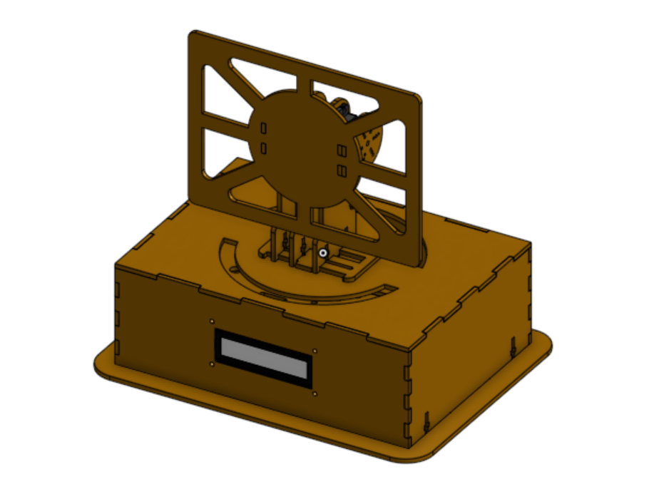
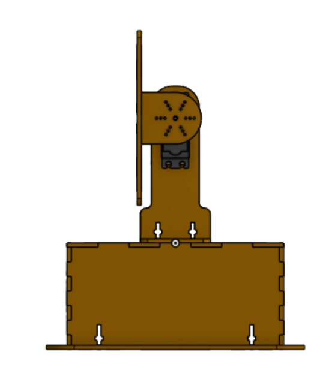

# 🌞 FPGA Dual-Axis Solar Tracker


Un sistema de seguimiento solar de dos ejes (Altazimutal) de alto rendimiento. Este proyecto implementa una arquitectura híbrida donde los cálculos astronómicos complejos se resuelven en **Python**, mientras que el control de actuadores en tiempo real y la gestión de periféricos se ejecutan en hardware dedicado (**FPGA**).

<p align="center">
  
  
</p>

## 📋 Características Principales

* **Arquitectura Híbrida:** Nodo maestro en Python para mecánica celeste y FPGA para control determinista.
* **Rango Extendido (270°):** Algoritmo de interpolación y calibración PWM personalizada (500us - 2500us) para aprovechar el rango completo de los servos MG995.
* **Precisión Astronómica:** Uso de la librería `Pysolar` para seguimiento basado en ubicación geográfica (GPS/Coordenadas) y hora real, resistente a nubosidad.
* **Interfaz Visual:** Pantalla LCD 1602A con rotación de datos (Coordenadas / Hora / Ubicación).
* **Conectividad:** Enlace Serial/Bluetooth para telemetría y control.
* **Diseño Mecánico Optimizado:** Estructura en MDF de 3mm cortado a láser con acoples de transmisión de potencia impresos en 3D (PLA).

## 🛠️ Hardware Requerido

| Componente | Descripción | Función |
| :--- | :--- | :--- |
| **FPGA** | Intel Cyclone IV (o similar) | Cerebro lógico, generación PWM, control LCD. |
| **Actuadores** | Tower Pro MG995 | Movimiento de Azimut y Elevación (Metal Gear). |
| **Comunicación** | Módulo HC-05 | Enlace Bluetooth UART con el nodo maestro. |
| **Pantalla** | LCD 1602A | Visualización de estado en tiempo real. |
| **Potencia** | LM2596 (Buck Converter) | Regulación eficiente de 5V para servos y lógica. |
| **Estructura** | MDF 3mm + PLA | Chasis y acoples mecánicos. |

## 📂 Estructura del Proyecto

```text
├── /rtl            # Código fuente Verilog (Módulos, FSM, Top Level)
├── /software       # Scripts de Python (Controlador Maestro)
├── /cad            # Archivos DXF (Corte Láser) y STL (Impresión 3D)
├── /docs           # Diagramas, Datasheets y Manuales
└── README.md       # Documentación principal
